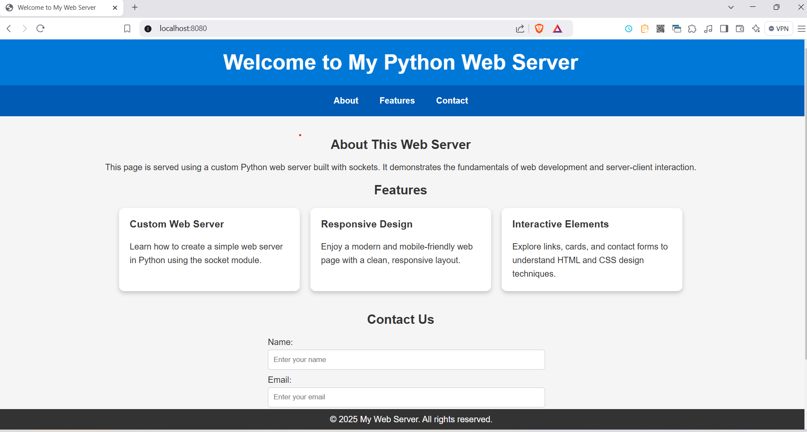

# Python Web Server with HTML Page

A simple Python-based web server using the `socket` module to serve an HTML page. This project demonstrates how to create a basic web server from scratch and deliver static content to the browser.

---

## Features

- Custom-built web server using Python's `socket` library.
- Serves an HTML page.

---

## Prerequisites

Before running the server, ensure the following are installed on your system:

- **Python 3.x**

To check if Python is installed:
```bash
python --version
```

---

## How to Run

1. **Clone the Repository:**
   ```bash
   git clone https://github.com/ajiteveryone8/create-own-http-server-with-python
   cd create-own-http-server-with-python
   ```

2. **Run the Server:**
   Execute the Python script to start the server.
   ```bash
   python main.py
   ```

3. **Access the Web Page:**
   Open your web browser and navigate to:
   ```
   http://localhost:8080/
   ```

---

## Project Structure

```
.
├── main.py          # Python script for the web server
└── index.html         # HTML file served by the server

```

---

## HTML Page Preview

The web page served by the server includes:

- **Welcome Header**: A title welcoming users.
- **Navigation Bar**: Links to different sections (About, Features, Contact).
- **Features Section**: Highlighting key aspects of the server.
- **Contact Form**: A form for users to submit their details.

### Screenshot


---

## Contributing

Contributions are welcome! If you'd like to contribute:

1. Fork this repository.
2. Create a new branch:
   ```bash
   git checkout -b feature/YourFeature
   ```
3. Commit your changes:
   ```bash
   git commit -m "Add YourFeature"
   ```
4. Push to the branch:
   ```bash
   git push origin feature/YourFeature
   ```
5. Open a pull request.

---


## Acknowledgements

- Inspired by Python's capability to create custom servers.
- HTML and CSS design enhanced with responsiveness and interactivity.

---


